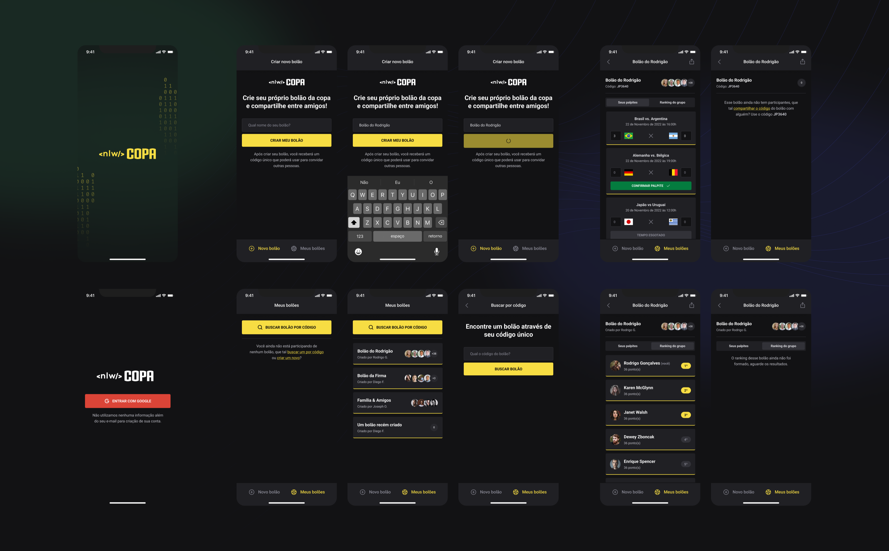

# Bolões da Copa - NLW Rocketseat


---
* [Descrição](#Descrição)
* [Principais Tecnologias Utilizadas](#Principais-Tecnologias-Utilizadas)
* [Clonar e Rodar Localmente](#Clonar-e-Rodar-Localmente)
  * [Requisitos](#Requisitos)
  * [Clone do projeto](#Clone-do-projeto)
  * [Configuração servidor node](#Configuração-servidor-node)
  * [Configuração aplicação web](#Configuração-aplicação-web)
  * [Configuração app mobile](#Configuração-app-mobile)
---

## Descrição

### Finalidade
NLW Copa é uma aplicação para web e mobile afim de gamificar entre usuários, palpites de resultados dos jogos da copa.

Sendo possível criar Bolões referentes a jogos em que outros usuários logados e autenticados com suas contas Google, podem participar e dar seus palpites de pontuação.

### Como surgiu
Este projeto é um acompanhamento do evento NLW da [Rocketseat](https://rocketseat.com.br) que rolou durante a primeira semana de novembro de 2022.

Com o intuito de agregar conhecimento prático em cima de algumas das tecnologias mais atualizadas do mercado, o evento NLW Copa instruiu a Contrução de uma aplicação completa com backend e frontend, tanto web quanto mobile.

---

### Web


### Mobile


---

## Principais Tecnologias Utilizadas

### Backend
 - [Node.JS](https://nodejs.org/en/)
 - [Fastify](https://www.fastify.io/)
 - [Typescript](https://www.typescriptlang.org/)
 - [Prisma](https://www.prisma.io/)

### Web
 - [ReactJS](https://reactjs.org/)
 - [Typescript](https://www.typescriptlang.org/)
 - [Next.JS](https://nextjs.org/)
 - [Tailwind](https://tailwindcss.com/)

### Mobile
 - [React Native](https://reactnative.dev/)
 - [Typescript](https://www.typescriptlang.org/)
 - [Expo](https://expo.dev/)
 - [Native Base](https://nativebase.io/)

 ---

 ## Clonar e Rodar Localmente

 ### Requisitos
 - [Git](https://git-scm.com/) instalado.
 - [Node.JS](https://nodejs.org/en/) **v18** ou superior instalado.
 - Acesso a um smartphone com o app [Expo Android](https://play.google.com/store/apps/details?id=host.exp.exponent&hl=pt_BR&gl=US) ou [Expo IOS](https://apps.apple.com/us/app/expo-go/id982107779) instalado ou um emulador.

 ### Clone

```
$ git clone https://github.com/otiagosantos/nlw-copa.git

$ cd nlw-copa
```

### Configuração servidor node

Entrar na pasta e instalar pacotes do node:
```
$ cd server

$ npm install
```

Executar migrations e seeds do prisma:
```
$ npm run migrate:dev

$ npx prisma db seed
```

Através de um editor de código de sua preferência, siga os seguntes passos:

Renomeie o arquivo .env.example para .env e a URL de coneção do seu banco de dados relacional em `DATABASE_URL` caso tenha preferência por outro banco que não o SQLite.

Ainda no mesmo arquivo .env, na variável `JWT_SECRET` escolha uma chave secreta para a sua aplicação caso prefira, senão ainda é possível manter a chave padrão de exemplo.

### Configuração aplicação web

Entrar na pasta e instalar pacotes do node:
```
#A partir da raiz do projeto:
$ cd web

$ npm install
```

Rodar aplicação:
```
$ npm run dev
```

### Configuração app mobile

Entrar na pasta e instalar pacotes do node:
```
#A partir da raiz do projeto:
$ cd mobile

$ npm install
```

Rodar Bundling e sincronizar com expo do smartphone:
```
$ npx expo start
```

Em seguida abra o app Expo e adicione o link exibido no terminal ou acesse com o leitor de QRCode.

Caso necessário pressione a tecla R no terminal para dar refresh no app.
